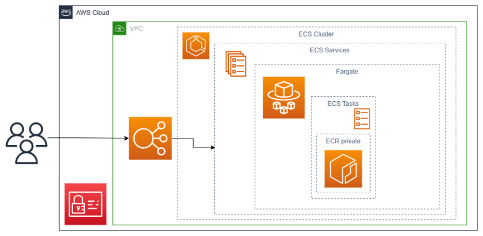
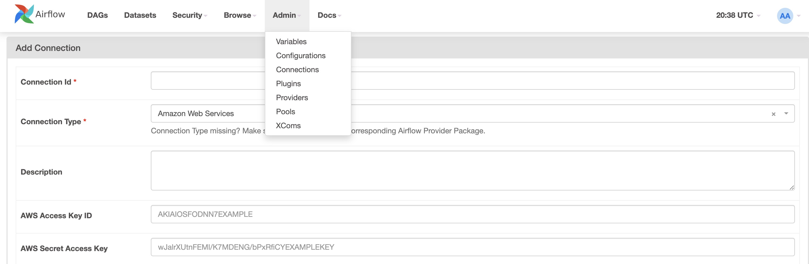
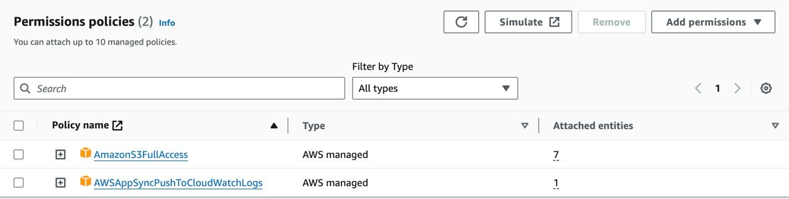
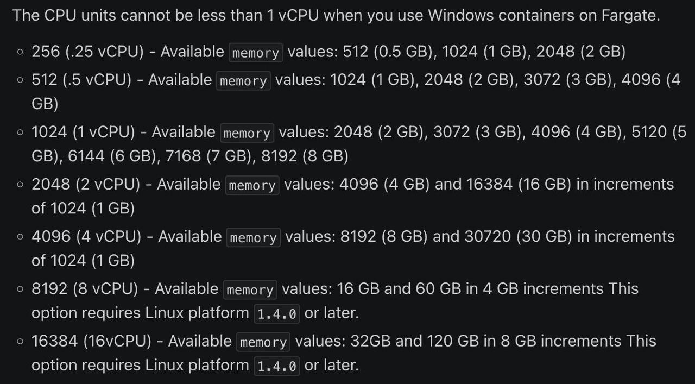

# Running Containers with Airflow’s ECSOperator

## Table of Contents

- [Running Containers with Airflow’s ECSOperator](#running-containers-with-airflows-ecsoperator)
  - [Table of Contents](#table-of-contents)
  - [Introduction](#introduction)
  - [ECS Architecture](#ecs-architecture)
  - [Prerequisites](#prerequisites)
    - [Add Amazon Web Service Connection on Airflow](#add-amazon-web-service-connection-on-airflow)
    - [Attach required permission to the ECS role](#attach-required-permission-to-the-ecs-role)
  - [Sample DAGs](#sample-dags)
    - [Upload file to S3](#upload-file-to-s3)
      - [Notes](#notes)

## Introduction

Apache Airflow’s ECSOperator allows you to run tasks on Amazon Elastic Container Service (ECS), a fully managed container orchestration service.

## ECS Architecture

Sure, here's some information about the components of Amazon ECS architecture:

1. **Cluster**: An Amazon ECS cluster is a logical grouping of tasks or services. If you're running tasks or services that use the EC2 launch type, a cluster is also a grouping of container instances. If you're using capacity providers, a cluster is also a logical grouping of capacity providers.

2. **Task Definition**: A task definition is required to run Docker containers in Amazon ECS. Some of the parameters you can specify in a task definition include:
    - Which Docker images to use with your tasks.
    - How much CPU and memory to use with your tasks.
    - What (if any) ports from your task's containers should be open to the internet or other tasks.
    - What data volumes should be used with your tasks' containers.
    - Whether your tasks should be linked to other tasks.

3. **Namespace**: In Amazon ECS, a namespace is used for isolation (i.e., to separate resources). Not to be confused with a Kubernetes namespace, it is a logical partitioning scheme for Amazon CloudWatch metrics. You can specify a namespace for a metric when you create it.

4. **Task**: A task is the instantiation of a task definition within a cluster. After you have created a task definition for your application within Amazon ECS, you can specify the number of tasks to run on your cluster.

## Prerequisites

### Add Amazon Web Service Connection on Airflow

1. **Open the Airflow UI**: Navigate to the Airflow webserver running on your local machine or server.

2. **Access Admin Panel**: On the top navigation bar, click on `Admin` and then select `Connections` from the dropdown menu.

3. **Add a New Connection**: Click on the `+` button on the right side of the screen to add a new connection.

4. **Fill in Connection Details**: In the `Add Connection` form, fill in the following details:
    - **Conn Id**: Enter a unique identifier for this connection. For example, `aws_ecs`.
    - **Conn Type**: Select the connection type that matches your service. For Amazon ECS, select `Amazon Web Services`.

5. **Save Connection**: Click on `Save` at the bottom of the page to save your new connection.

### Attach required permission to the ECS role

In order to attach the Amazon S3 Full Access policy to the `ecsTaskExecutionRole` IAM role, follow these steps:

1. **Open the IAM console**: Navigate to the IAM console on your AWS Management Console.

2. **Select Roles**: In the navigation pane on the left, choose `Roles`.

3. **Search for the Role**: In the search box, enter `ecsTaskExecutionRole`. If the role exists, select it.

4. **View Attached Policies**: On the `Permissions` tab, you can view the policies that are currently attached to the role.

5. **Attach the Amazon S3 Full Access Policy**: To attach the Amazon S3 Full Access policy, follow these steps:
    - Click `Add Permissions`, then `Attach policies`¹.
    - In the `Filter policies` search box, enter `AmazonS3FullAccess`.
    - Check the box to the left of the `AmazonS3FullAccess` policy.
    - Click `Attach policy`.

## Sample DAGs

### Upload file to S3

**DAG File Name**: `upload_file_to_s3_dag.py`

**Docker Image Content Files Location**: `/examples/upload_file_to_s3/`

Before running this DAG, make sure you have changed the strings with `<something>` format in the [DAG file](./dags/upload_file_to_s3_dag.py).

#### Notes

- In order to set the proper value for the CPU and memory, check the documentation:

    
